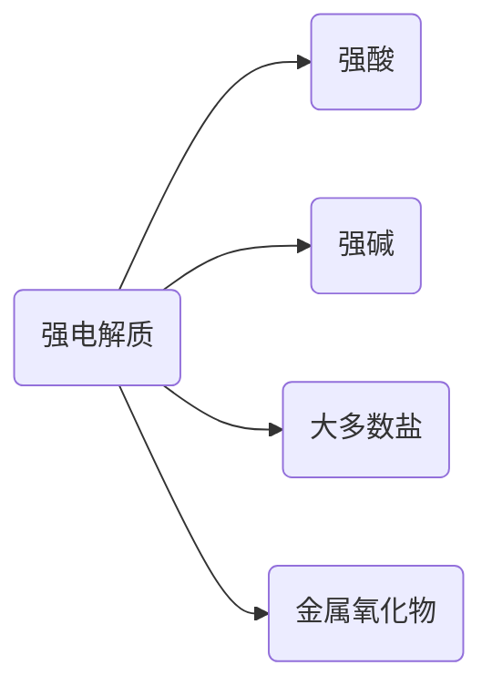
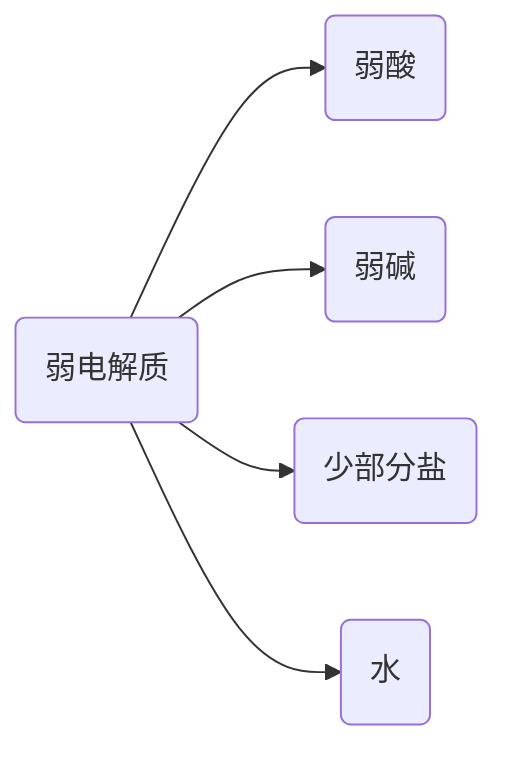

# 电解质与非电解质

## 一、电解质和非电解质

### 1. 电解质

在水溶液 **或** 熔融状态下能够导电的化合物叫作电解质。

### 2. 非电解质

在水溶液 **和** 熔融状态下都不能导电的化合物叫作非电解质。

## 二、电解质的电离

### 1. 导电的原因

:pencil2:导电的条件:具有能 **自由移动**的、**带电** 的粒子。

【总结】金属、熔融电解质或电解质溶液导电的原因。

1. 金属导电:具有能自由移动的 **电子**;
2. 熔融电解质或电解质溶液导电:具有能自由移动的 **离子**。

### 2. 强、弱电解质

根据在水中能否完全电离，可以将电解质分为强电解质和弱电解质。

#### (1) 强电解质

在水中能够 **完全电离** 的电解质叫强电解质。

#### (2) 弱电解质

在水溶液中 **不完全电离** 的电解质叫弱电解质。

### 3. 电离方程式

#### (1) 强电解质的电离

强电解质的电离用“ $\ce{=}$ ”。

#### (2) 弱电解质的电离

弱电解质的电离用“ $\ce{<=>}$ ”。

1. 多元弱酸 **分步** 电离，**分步** 书写。
2. 多元弱碱 **分布** 电离，**一步** 书写。

\$\ce{非电解质 -> 电解质 -> 电离}$

### 4. 导电能力影响因素

溶液导电能力的影响因素: **离子浓度**、**电荷数** 和 **离子种类**。
